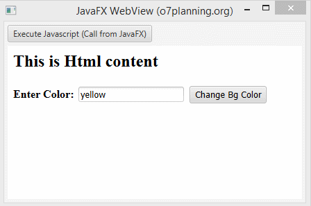

# Final Project

**Title:** Items Application Manager  
**Name:** Patrick Murphy  
**Student ID:** G00123456  

## Application Function

Discuss, in detail, what the application does. Add a screenshot image of the application in use (See example of image added below). 

## Running the Application

Provide step by step instructions on how to run your application. Are there any software installs required? 

```MARKDOWN
List the instructions step by step
    1. Open the repository in codespaces
    2. Install Extension Pack for Java
    3. Open the Main class
    4. Click on the run icon on the top right
            :
```

## Minimum Project Requirements

Confirm and demonstrate how you have met all minimum project requirements:

* The project, including code and documentation, will be fully contained in the provided Git Classroom repo.
* The project must contain a working JavaFX GUI which manages items of your choice.
* The GUI must at minimum provide access to all 7 methods implemented in the Student Manager App.
* Methods = Load DB, Add Item, Delete Item, Find item by ID/Name, Show total items, Save to DB, Quit.
* The code MUST compile. 30% grade reduction if code does not compile.
* The application code must be formatted in a consistent and standard way.
* The code must contain comments. One comment per class, method and variable at minimum.
* There must be two commits per week minimum (Note: Should be many commits per day coding).
* The documentation and commentary must be free of a grammar and speling mistakes.

## Project Requirments above and beyond

Discuss any application features or design elements that show you went above and beyond basic requirments.

## Application Architecture

Discuss in detail how the application is structured. List all Classes. List their method and what they do. Discuss what structures are used to store data objects.

Add a screenshot of the application architecture.

## JavaFX

Discuss the GUI design used. Discuss why you chose this design and any features you thing make your application stands out.



## Roadblocks and Unfinished Functionality

Discuss the issues you faced with creating your application. Provide possible solutions to these issues. What would you have done differently if you had to do this again? What did you not get finished?

## Resources

Provide links to resources used:

* [Tutorialspoint](https://www.tutorialspoint.com/java/) - Java Tutorials site I found helpful
